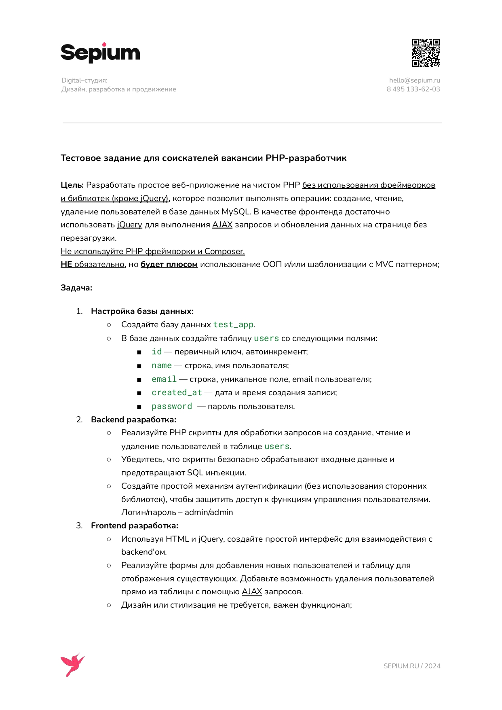

#### Краткий обзор
+ `.docker` - докер образ
+ `bundle` - классы помощники
+ `migrations` - таблицы
+ `request` - обрабатываемые запросы
+ `src` - основной пул классов
+ `templates` - кусочки html
+ `var` - для прочего
+ `.env` - конфигурация

Старался сделать односложные классы, для явного понимания происходящего. Если что-то не понятно, смогу ответить
<a href="https://t.me/lavreek">напишите</a>

#### Тестовое задание
